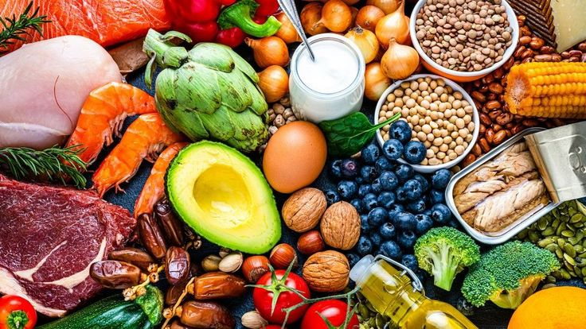

<picture>
  <source media="(prefers-color-scheme: dark)" srcset="https://img.shields.io/badge/Python-3.12-00e676?style=flat&logo=python&logoColor=white">
  
</picture>
<picture>
  <source media="(prefers-color-scheme: dark)" srcset="https://img.shields.io/badge/Flask-3.1-00e676?style=flat&logo=flask&logoColor=white">
  
</picture>
<picture>
  <source media="(prefers-color-scheme: dark)" srcset="https://img.shields.io/badge/SQLite-00e676?style=flat&logo=sqlite&logoColor=white">
  
</picture>
<picture>
  <source media="(prefers-color-scheme: dark)" srcset="https://img.shields.io/badge/license-MIT-00e676?style=flat">
  
</picture>

# NutriExpert — IA de Evaluación Nutricional

Sistema experto clínico para la evaluación antropométrica y nutricional automatizada. Calcula indicadores clave de composición corporal, gasto energético y macronutrientes de forma personalizada, ayudando a profesionales y usuarios a dar seguimiento objetivo a su evolución física.

---

## ¿Qué problema resuelve?

La evaluación nutricional manual requiere tiempo, conocimiento de múltiples fórmulas y está propensa a errores de cálculo. NutriExpert automatiza todo el proceso clínico:

1. **Registras** datos antropométricos básicos (peso, estatura, edad, sexo, actividad física)
2. **El sistema** aplica fórmulas validadas científicamente
3. **Obtienes** un informe completo con interpretación de cada indicador

> Esto permite que tanto nutricionistas como personas sin formación técnica obtengan evaluaciones precisas y consistentes.

---

## Conceptos que aprenderás usando NutriExpert

### Índice de Masa Corporal (IMC)
Relación entre peso y estatura. El sistema clasifica el resultado según los estándares de la OMS (bajo peso, normal, sobrepeso, obesidad).

### Peso Ideal (fórmula de Devine)
Estimación del peso saludable basada en estatura y sexo. Se complementa con el rango saludable de IMC.

### Composición Corporal
- **Masa grasa** y **masa magra** — estimadas a partir del porcentaje de grasa corporal ingresado
- **Agua corporal total** — calculada con la fórmula de Watson, que usa peso, estatura, edad y sexo
- **Somatotipo estimado** — clasificación endomorfo/mesomorfo/ectomorfo según la composición

### Gasto Energético
- **Tasa Metabólica Basal (TMB)** — calorías que gastas en reposo absoluto, calculada con la ecuación de Mifflin-St Jeor
- **Gasto energético total** — TMB ajustada por tu nivel de actividad física (sedentario a extremo)
- **Calorías objetivo** — según tu meta: hipertrofia (superávit calórico), mantenimiento, o pérdida de grasa (déficit)

### Macros
Distribución personalizada de proteínas, carbohidratos y grasas en gramos y calorías, adaptada a tu objetivo.

---

## Capturas de pantalla

| Landing | Evaluación | Resultados |
|---|---|---|
|  |  |  |
| Página principal con acceso | Formulario de 4 pasos | Reporte clínico completo |

---

## Características

- **Autenticación segura** — registro e inicio de sesión con hash de contraseñas (bcrypt) y protección CSRF
- **Formulario clínico interactivo** — 4 pasos guiados con validación en vivo
- **Reporte inteligente** — resultados con interpretación de cada indicador y valores de referencia
- **Historial de evaluaciones** — seguimiento cronológico de tu evolución
- **Dos roles** — usuario regular (autoevaluación) y nutricionista (gestión de pacientes)
- **Diseño responsivo** — interfaz oscura con acentos neón, adaptable a dispositivos móviles

---

## Tecnologías

| Capa | Tecnología |
|---|---|
| Backend | Python 3.12 + Flask 3.1 |
| Base de datos | SQLite + SQLAlchemy 2.x (ORM) |
| Autenticación | Flask-Login (sesiones) + bcrypt |
| Frontend | HTML5 + CSS3 + JavaScript vanilla |
| Plantillas | Jinja2 |
| Seguridad | Flask-WTF / CSRFProtect |

---

## Inicio rápido

```bash
# 1. Clonar el repositorio
git clone https://github.com/tu-usuario/IA-NUTRICIOONAL.git
cd IA-NUTRICIOONAL

# 2. Crear y activar entorno virtual
python -m venv venv
source venv/bin/activate   # Linux/macOS
# venv\Scripts\activate    # Windows

# 3. Instalar dependencias
pip install -r requirements.txt

# 4. Configurar variables de entorno
cp .env.example .env
# Editar SECRET_KEY en .env

# 5. Inicializar base de datos
flask init-db

# 6. Ejecutar servidor
flask run --debug
```

Abrir [http://127.0.0.1:5000](http://127.0.0.1:5000) en el navegador.

---

## Estructura del proyecto (visión general)

```
IA-NUTRICIOONAL/
├── run.py                 # Punto de entrada
├── requirements.txt       # Dependencias
├── .env                   # Configuración (no se sube a git)
│
├── app/
│   ├── __init__.py        # Fábrica de la aplicación
│   ├── config.py          # Configuración desde .env
│   ├── extensions.py      # Extensiones de Flask
│   ├── models.py          # Modelos de base de datos
│   │
│   ├── auth/              # Registro e inicio de sesión
│   ├── dashboard/         # Evaluaciones y reportes
│   ├── main/              # Página principal
│   ├── nutritionist/      # Panel del nutricionista
│   │
│   ├── services/          # Motor clínico (cálculos)
│   ├── templates/         # Plantillas HTML
│   └── static/            # CSS, JS, imágenes
│
└── instance/
    └── nutriexpert.db     # Base de datos SQLite
```

---

## Roles de usuario

| Rol | Acceso |
|---|---|
| `user` | Evaluaciones propias, historial, reportes |
| `nutritionist` | Gestión de pacientes y sus evaluaciones |

El rol se asigna al crear el usuario; por defecto es `user`.

---

## Estado del proyecto

- [x] Registro, inicio de sesión y cierre de sesión
- [x] Formulario de evaluación clínica (4 pasos)
- [x] Generación y visualización de reportes
- [x] Historial de evaluaciones
- [x] Panel base para nutricionistas
- [ ] Motor clínico completo con todas las fórmulas
- [ ] Panel funcional de nutricionista con lista de pacientes

---

## Licencia

MIT
